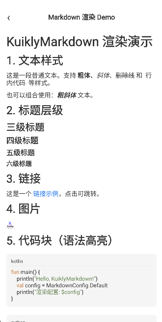
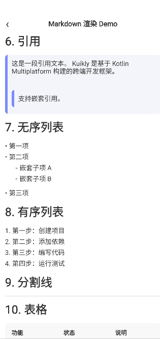
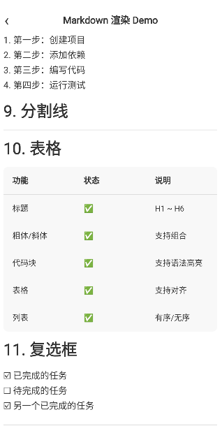

# KuiklyMarkdown

基于 [Kuikly](https://github.com/Tencent-TDS/KuiklyUI) 跨端框架的 **Markdown 渲染组件**，使用Kuikly DSL构建的markdown组件，支持 Android、iOS、HarmonyOS（鸿蒙）平台。

## 特性

- **丰富的 Markdown 语法支持** — 标题、粗体/斜体、代码块、表格、列表、引用、图片、链接等
- **代码语法高亮** — 内置 [Highlights](https://github.com/nicholasgasior/highlights) 库，支持 19 种编程语言
- **组件可替换** — 支持 21 种块级元素的自定义渲染
- **跨端一致** — 一套代码，多端渲染

## 效果展示

<p align="center">
  
  
  
</p>


## 快速开始

### 1. 添加依赖

在你的 KMP 模块的 `build.gradle.kts` 中添加依赖：

**标准平台（Android / iOS / Web）：**

```kotlin
kotlin {
    sourceSets {
        val commonMain by getting {
            dependencies {
                api("com.tencent.kuikly-open:core:${kuiklyVersion}")
                api("com.tencent.kuiklybase:KuiklyMarkdown:1.0.2-2.0.21")
            }
        }
    }
}
```

**鸿蒙平台（HarmonyOS）：**

```kotlin
kotlin {
    sourceSets {
        val commonMain by getting {
            dependencies {
                api("com.tencent.kuikly-open:core:${kuiklyVersion}")
                api("com.tencent.kuiklybase:KuiklyMarkdown:1.0.2-2.0.21-ohos")
            }
        }
    }
}
```

### 2. 基本使用

在 Kuikly 的 `ViewContainer` 中直接调用 `KuiklyMarkdown` 即可渲染 Markdown 内容：

```kotlin
import com.tencent.kuiklybase.KuiklyMarkdown
import com.tencent.kuiklybase.config.MarkdownConfig

// 在你的 Page 的 body() 中
Scroller {
    attr {
        flex(1f)
    }
    View {
        attr {
            padding(16f)
        }
        KuiklyMarkdown(
            content = "# Hello World\n\nThis is **bold** text.",
            config = MarkdownConfig.Default,
        )
    }
}
```

### 3. API 参数说明

```kotlin
fun ViewContainer<*, *>.KuiklyMarkdown(
    content: String,                                        // Markdown 原始文本
    config: MarkdownConfig = MarkdownConfig.Default,        // 渲染配置
    components: MarkdownComponents = markdownComponents(),  // 自定义组件集合
    flavour: MarkdownFlavourDescriptor = GFMFlavourDescriptor(), // Markdown 风味（默认 GFM）
    lookupLinks: Boolean = true,                            // 是否查找引用链接定义
)
```

## 自定义样式

`MarkdownConfig` 提供了 **颜色、排版、尺寸、间距** 四大维度的样式配置，所有配置项都有合理的默认值，可按需覆盖。

### 颜色配置 — `MarkdownColors`

```kotlin
MarkdownConfig(
    colors = MarkdownColors(
        text = 0xFF333333,                // 文本颜色
        codeBackground = 0xFFF5F5F5,      // 代码块背景色
        inlineCodeBackground = 0xFFE8E8E8,// 行内代码背景色
        dividerColor = 0xFFDDDDDD,        // 分割线颜色
        tableBackground = 0xFFF8F8F8,     // 表格背景色
        blockQuoteBar = 0xFF7B8CFA,       // 引用块竖线颜色
        blockQuoteBackground = 0xFFF4F5FA,// 引用块背景色
        linkColor = 0xFF1A73E8,           // 链接颜色
        codeText = 0xFF333333,            // 代码文本颜色
    )
)
```

### 排版配置 — `MarkdownTypography`

支持 **16 种** 文本样式，每种可配置字号、字重、字体、行高、颜色：

```kotlin
MarkdownConfig(
    typography = MarkdownTypography(
        text = TextStyleConfig(fontSize = 16f),
        code = TextStyleConfig(fontSize = 14f, fontFamily = "monospace"),
        inlineCode = TextStyleConfig(fontSize = 14f, fontFamily = "monospace"),
        h1 = TextStyleConfig(fontSize = 32f, fontWeight = FontWeight.Bold),
        h2 = TextStyleConfig(fontSize = 28f, fontWeight = FontWeight.Bold),
        h3 = TextStyleConfig(fontSize = 24f, fontWeight = FontWeight.Bold),
        h4 = TextStyleConfig(fontSize = 20f, fontWeight = FontWeight.Bold),
        h5 = TextStyleConfig(fontSize = 18f, fontWeight = FontWeight.Bold),
        h6 = TextStyleConfig(fontSize = 16f, fontWeight = FontWeight.Bold),
        quote = TextStyleConfig(fontSize = 16f, fontStyle = FontStyle.Italic),
        paragraph = TextStyleConfig(fontSize = 16f),
        ordered = TextStyleConfig(fontSize = 16f),
        bullet = TextStyleConfig(fontSize = 16f),
        list = TextStyleConfig(fontSize = 16f),
        table = TextStyleConfig(fontSize = 14f),
        textLink = TextStyleConfig(fontSize = 16f),
    )
)
```

`TextStyleConfig` 支持的属性：

| 属性 | 类型 | 说明 |
|------|------|------|
| `fontSize` | `Float` | 字号（默认 16f） |
| `fontWeight` | `FontWeight` | 字重：`Normal`(400) / `Medium`(500) / `SemiBold`(600) / `Bold`(700) |
| `fontStyle` | `FontStyle` | 字体样式：`Normal` / `Italic` |
| `color` | `Long?` | 文本颜色，`null` 表示继承默认文本色 |
| `fontFamily` | `String?` | 字体族，`null` 表示使用系统默认字体 |
| `lineHeight` | `Float?` | 行高 |

### 尺寸配置 — `MarkdownDimens`

```kotlin
MarkdownConfig(
    dimens = MarkdownDimens(
        dividerThickness = 1f,          // 分割线厚度
        codeBackgroundCornerSize = 8f,  // 代码块圆角
        blockQuoteThickness = 6f,       // 引用块竖线粗细
        blockQuoteCornerSize = 8f,      // 引用块圆角
        tableMaxWidth = 0f,             // 表格最大宽度（0 = 不限制）
        tableCellWidth = 160f,          // 表格单元格宽度
        tableCellPadding = 16f,         // 表格单元格内边距
        tableCornerSize = 8f,           // 表格圆角
    )
)
```

### 间距配置 — `MarkdownPadding`

```kotlin
MarkdownConfig(
    padding = MarkdownPadding(
        block = 4f,                     // 块级元素间距
        list = 4f,                      // 列表间距
        listItemTop = 4f,              // 列表项顶部间距
        listItemBottom = 4f,           // 列表项底部间距
        listIndent = 16f,              // 列表嵌套缩进
        codeBlock = 12f,               // 代码块内边距
        blockQuotePaddingLeft = 16f,   // 引用块左侧内边距
        blockQuoteBarPaddingLeft = 4f, // 引用块竖线间距
        blockQuoteTextVertical = 12f,  // 引用块文本上下间距
    )
)
```

### 其他配置项

```kotlin
MarkdownConfig(
    // 链接点击处理
    onLinkClick = { url ->
        println("点击了链接: $url")
    },
    // 图片 URL 变换（可用于添加 CDN 前缀等）
    imageUrlTransformer = { url ->
        "https://cdn.example.com/$url"
    },
    // 有序列表标记生成器
    orderedListBullet = { index, listNumber, depth ->
        "${listNumber + index}. "
    },
    // 无序列表标记生成器
    unorderedListBullet = { index, depth ->
        when (depth % 3) {
            0 -> "• "
            1 -> "◦ "
            else -> "▪ "
        }
    },
    // 是否将 EOL 视为换行
    eolAsNewLine = false,
    // 代码高亮开关
    codeHighlightEnabled = true,
    // 代码高亮暗色主题
    codeHighlightDarkTheme = false,
)
```

## 自定义组件

通过 `markdownComponents()` 工厂函数，可以替换任意块级元素的渲染实现。只需覆盖你想自定义的组件，其余使用默认实现：

```kotlin
KuiklyMarkdown(
    content = markdownText,
    config = myConfig,
    components = markdownComponents(
        // 自定义代码块渲染
        codeFence = { model, container ->
            container.apply {
                View {
                    attr {
                        backgroundColor(Color(0xFF1E1E1E))
                        borderRadius(12f)
                        padding(16f)
                    }
                    Text {
                        attr {
                            text(model.content)
                            fontSize(13f)
                            color(Color(0xFFD4D4D4))
                            lines(Int.MAX_VALUE)
                        }
                    }
                }
            }
        },
        // 处理未识别的自定义节点类型
        custom = { type, model, container ->
            // 返回 true 表示已处理，false 表示跳过
            false
        },
    ),
)
```

### 支持替换的组件列表（共 21 种）

| 组件 | 说明 |
|------|------|
| `text` | 普通文本 |
| `eol` | 换行 |
| `codeFence` | 围栏代码块（\`\`\`） |
| `codeBlock` | 缩进代码块 |
| `heading1` ~ `heading6` | 一级 ~ 六级标题 |
| `setextHeading1` / `setextHeading2` | Setext 风格标题 |
| `blockQuote` | 引用块 |
| `paragraph` | 段落 |
| `orderedList` | 有序列表 |
| `unorderedList` | 无序列表 |
| `image` | 图片 |
| `horizontalRule` | 水平分割线 |
| `table` | 表格 |
| `checkbox` | 复选框 |
| `custom` | 自定义节点类型处理 |


## License

本项目采用 [MIT License](LICENSE) 开源。

本项目包含以下第三方开源库的源码，它们保留各自原始的 Apache License 2.0 协议：

- [intellij-markdown](https://github.com/JetBrains/markdown) — Copyright JetBrains s.r.o. (Apache 2.0)
- [Highlights](https://github.com/SnipMeDev/Highlights) — Copyright SnipMeDev (Apache 2.0)
- [multiplatform-markdown-renderer](https://github.com/mikepenz/multiplatform-markdown-renderer) — Copyright Mike Penz; Erik Hellman (Apache 2.0)
